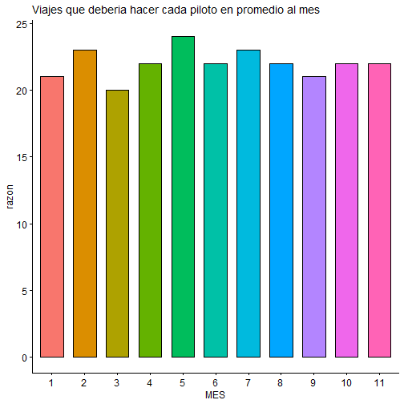
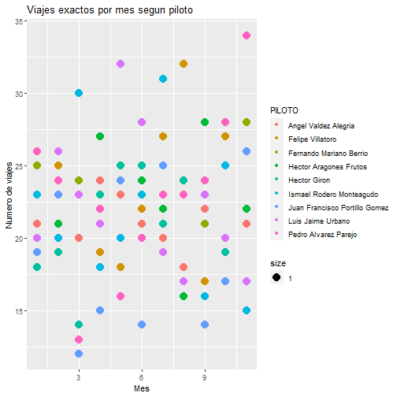
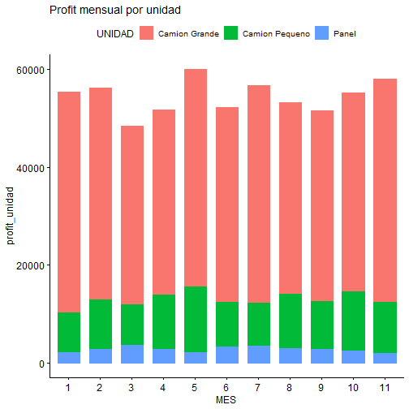
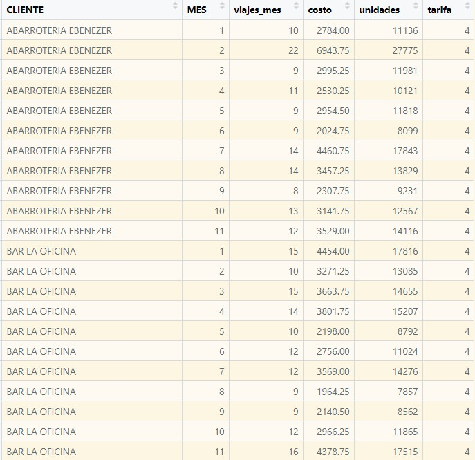
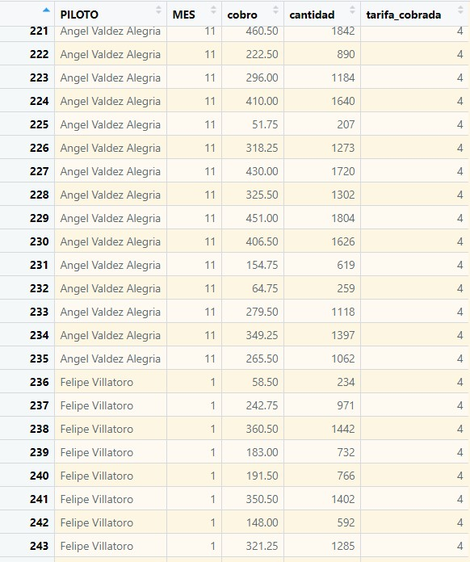
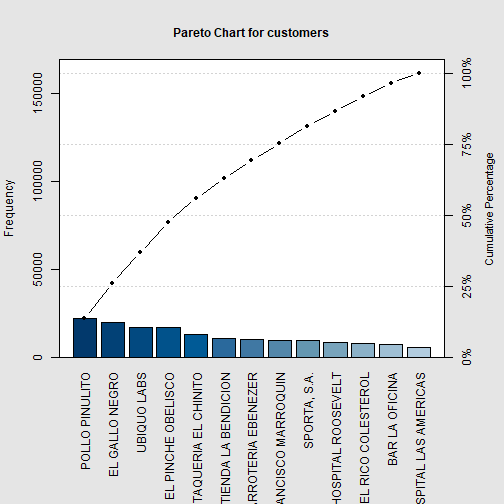
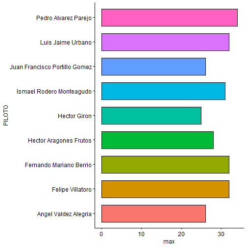
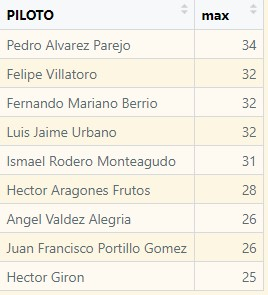
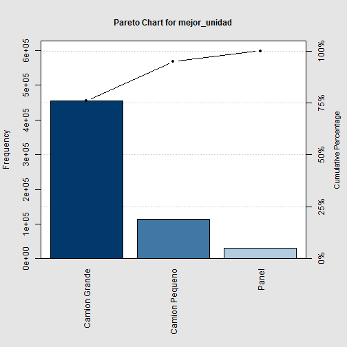

Lab 4: Analisis Distribuidora del Sur, S.A. 
========================================================
class:first
author: Lindsey
autosize: true
font-import: https://fonts.googleapis.com/css?family=Poppins
font-family: Poppins
css: style.css

Descripcion 
========================================================
class: second
La Junta Directiva de Distribuidora del Sur, S.A. esta preocupada por el flujo de caja de la empresa
de los ultimos meses. Comenzaban a surgir dudas sobre el rumbo a tomar en los anios por venir.

En la ultima asamblea de accionistas, el presidente de la  compania consulto al CEO sobre sus inquietudes.


Debemos invertir en la contratacion de mas personal?
========================================================
Para responder analizamos la cantidad de viajes que _debe_ realizar cada piloto y los viajes que _en realidad_ realiza. 


Debemos invertir en la contratacion de mas personal?
========================================================
De acuerdo al numero de viajes al mes en total, aproximadamente cada piloto debería hacer alrededor de 20-25 viajes.
<br>


Debemos invertir en la contratacion de mas personal?
========================================================


Debemos invertir en la contratacion de mas personal?
========================================================
Los viajes exactos que ha hecho cada piloto tienen una gran variación. Observando esto, se puede considerar politicas actuales con los pilotos porque algunos hacen muchos mas viajes que otros.


¿Debemos invertir en la compra de más vehículos de distribución? ¿Cuántos y de que tipo?
========================================================
Para esto se comparó el cobro que se hace por viajes mensuales que realiza cada tipo de vehículo


¿Debemos invertir en la compra de más vehículos de distribución? ¿Cuántos y de que tipo?
========================================================


¿Debemos invertir en la compra de más vehículos de distribución? ¿Cuántos y de que tipo?
========================================================


¿Debemos invertir en la compra de más vehículos de distribución? ¿Cuántos y de que tipo?
========================================================
Podemos concluir que hay menor ganancia con las paneles y hay más movimiento de camiones grandes. La mejor estrategia quedará al criterio del norte estratégico de la empresa, pero la mejor opción por la situación actual es dejar de invertir en viajes de paneles y aumentar en camiones grandes.

¿Debemos invertir en la compra de más vehículos de distribución? ¿Cuántos y de que tipo?
========================================================
Si se pretende reemplazar las paneles con camiones grandes

```
[1] "Unidades maximas soportadas por paneles:  500"
```

```
[1] "Unidades maximas soportadas por camiones grandes:  1996"
```

```
[1] "Camiones que pueden reemplazar paneles:  4"
```


Las tarifas actuales ¿son aceptables por el cliente?
========================================================
<br>

***
Tarifa: Q4 por unidad


Las tarifas actuales son aceptables por el cliente?
========================================================


Ganancias en tarifas: Primer mes del año vs último mes declarado (noviembre)

```
[1] "Primer mes del año: Q 55416.5  vs último: Q 58050"
```

```
[1] 1.047522
```

Las tarifas actuales ¿son aceptables por el cliente?
========================================================
Ganancias en tarifas: Penúltimo mes declarado (octubre) vs último mes declarado (noviembre)

```
[1] "Penultimo mes del año: Q 55416.5  vs último: Q 55179.5"
```

```
[1] 1.052021
```

Las tarifas actuales son aceptables por el cliente?
========================================================
En general hay un aumento en los pagos de los clientes, por lo que las tarifas se muestran aceptables.


Nos estan robando los pilotos?
========================================================
Observamos las tarifas que cobra cada piloto en sus viajes, las cuales normalmente deberían ser de Q4
***


Nos estan robando los pilotos?
========================================================
No existe evidencia estadística que demuestre que los pilotos estén robando. Las tarifas se ven normales en cada uno de los viajes que ha realizado cada uno de los pilotos


¿Qué estrategias debo seguir?
========================================================
Según lo observado en los análisis anteriores, las recomendaciones son:

* Considerar el cambio de políticas con los conductores para mejorar el número de viajes antes de aumentar el personal de la empresa.

* Considerar cambiar las paneles por camiones grandes.

* Hacer tarifas más atractivas para los clientes según cantidad de mercadería transportada.

Adicionalmente, segun los tipos de pedido, se puede tener más cuidado al escoger unidades para entregas.


¿Qué estrategias debo seguir?
========================================================


```
[1] "Total de viajes(100%): 2180"
```

```
[1] "Porcentaje de despachos 0.618807339449541"
```

```
[1] "Porcentaje de viajes por devolución 0.0545871559633028"
```

```
[1] "Porcentaje de viajes por mercadería faltante 0.326605504587156"
```

80-20 de clientes y cuáles de ellos son los más importantes
========================================================
Delimitado por los siguientes pasos:

1. Determinar del último trimestre.

2. Informe de las ventas totales de cada cliente.

3. Identificar los clientes individuales que representan el mayor porcentaje de sus ventas dividiendo la compra total del cliente entre las ventas totales del período.


80-20 de clientes y cuáles de ellos son los más importantes
========================================================
Total de ventas (general):

```
[1] "Q  161464.5"
```

80-20 de clientes y cuáles de ellos son los más importantes
========================================================




Mejores pilotos y transportes más efectivos.
========================================================



Mejores pilotos y transportes más efectivos.
========================================================
<br>
La mejor racha de viajes al año pertenece a Pedro Alvarez y se debe reconocer a Felipe Villatoro, Fernando Mariano y Luis Urbano
***


Mejores pilotos y transportes más efectivos.
========================================================
<br>
El transporte más efectivo ha demostrado ser el camión grande.
***


Mejores pilotos y transportes más efectivos.
========================================================



