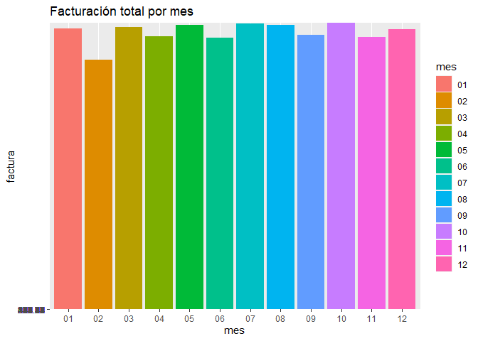
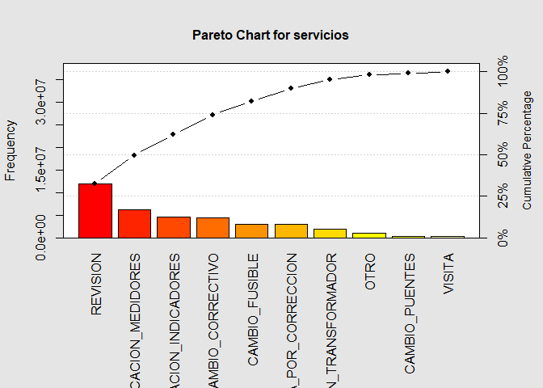
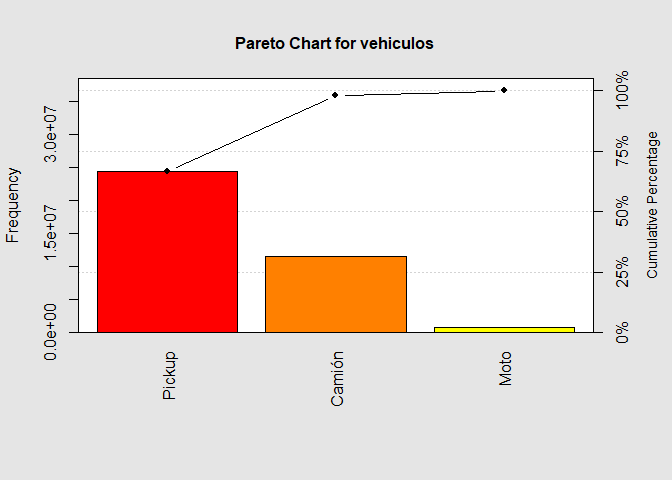
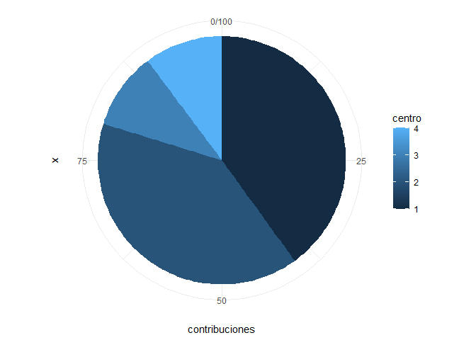

Informe de análisis de Inversiones en Energía, S.A. de C.V
================
Maite de la Roca

Inversiones en Energía, S.A. de C.V. ha tenido un gran 2019 con una
utilidad superior a los US$1 Millones. Durante estos 9 meses del 2020,
han tenido una baja del 25% con respecto al año anterior en su margen
operativo y el gerente de operaciones ha sido despedido. Como consultor
independiente, ofrecezco un estudio del mercado de la operación para que
el siguiente año la empresa pueda crecer por encima del 10% con respecto
al 2019. Una porción de los datos utilizados:

    ##       ID                      Cod origen factura height Vehiculo costoVehiculo
    ## 1 767918   REVISION_TRANSFORMADOR 150277   79.35     12   Camion         40.35
    ## 2 386136                 REVISION 150224  101.68     12   Camion         34.68
    ## 3 588199 VERIFICACION_INDICADORES 150224  118.86     14   Camion         52.86
    ## 4 658299    VISITA_POR_CORRECCION 150277   75.74      8   Camion         53.74
    ## 5 860501    VISITA_POR_CORRECCION 150277   81.29     10   Camion         46.29
    ## 6 662960   REVISION_TRANSFORMADOR 150277   90.54      8   Camion         41.54
    ##   costoDirectoVehiculo costoFijoVehiculo tiempo dia mes
    ## 1                24.61             15.73   5-30  16  01
    ## 2                20.81             13.87   5-30  14  06
    ## 3                32.77             20.09   5-30  03  05
    ## 4                34.39             19.35   5-30  14  05
    ## 5                31.01             15.28   5-30  11  09
    ## 6                28.25             13.29   5-30  17  05

## Puntos generales

  - Retrospectiva del 2019

  - Siguientes pasos y recomendaciones

### Retrospectiva del 2019

#### Breve estado de resultados

<!-- -->

<table>

<tr>

<th colspan="3">

Ganancias totales

</th>

</tr>

<tr>

<td>

Ingresos

</td>

<td>

Costos

</td>

<td>

Ganancias

</td>

</tr>

<tr>

<td>

Q. 36,688,096

</td>

<td>

Q. 28,174,019

</td>

<td>

Q. 8,514,077

</td>

</tr>

</table>

Comparación de períodos

Ganancia de los primeros 9 meses de 2020 comparados a 2019:

<strong>Q. 6,360,360 (2019)</strong>

<strong>Q. 5,088,288 (2020)</strong>

Hay una disminución sustancial de 25%. Para aumentar un 10% con respecto
al 2019 en el 2021 (en el mismo período) debe llegarse a la meta de:

<strong>Q. 5,597,117</strong>

Esto significaría un aumento de Q. 508,828.8 con respecto a los primeros
9 meses del 2020.

#### Tarifario

Las tarifas dependen de varias condiciones tales como servicio, tiempo,
unidad de transporte, entre otras.

En la empresa se manejan los vehículos:

  - Camión

  - Pickup

  - Moto

Las tarifas máximas, mínimas y promedio de cada vehículo según el tipo
de actividad se distribuyen de la siguiente manera:

<table>

<tr colspan="4">

<th>

Tarifas de Camión

</th>

</tr>

<tr>

<td>

Servicio

</td>

<td>

Máximo

</td>

<td>

Mínimo

</td>

<td>

Promedio

</td>

</tr>

<tr>

<td>

Revisión de transformador

</td>

<td>

Q. 511.14

</td>

<td>

Q. 27.81

</td>

<td>

Q. 191.49

</td>

</tr>

<tr>

<td>

Revisión general

</td>

<td>

Q. 503.26

</td>

<td>

Q. 31.85

</td>

<td>

Q. 184.63

</td>

</tr>

<tr>

<td>

Verificación de indicadores

</td>

<td>

Q. 509.63

</td>

<td>

Q. 27.29

</td>

<td>

Q. 191.39

</td>

</tr>

<tr>

<td>

Visita por corrección

</td>

<td>

Q. 474.84

</td>

<td>

Q. 26.62

</td>

<td>

Q. 177.08

</td>

</tr>

<tr>

<td>

Cambio correctivo

</td>

<td>

Q. 470.99

</td>

<td>

Q. 21.58

</td>

<td>

Q. 187.4238

</td>

</tr>

<tr>

<td>

Otro

</td>

<td>

Q. 470.76

</td>

<td>

Q. 31.6

</td>

<td>

Q. 186.07

</td>

</tr>

<tr>

<td>

Verificación de medidores

</td>

<td>

Q. 521.67

</td>

<td>

Q. 22.01

</td>

<td>

Q. 184.36

</td>

</tr>

<tr>

<td>

Cambio de fusibles

</td>

<td>

Q. 2,936,608

</td>

<td>

Q. 2,082,331

</td>

<td>

Q. 854,277

</td>

</tr>

<tr>

<td>

Cambio de puentes

</td>

<td>

Q. 449.11

</td>

<td>

Q. 24.56

</td>

<td>

Q. 197.14

</td>

</tr>

<tr>

<td>

Visita general

</td>

<td>

Q. 458.31

</td>

<td>

Q. 66.26

</td>

<td>

Q. 188.26

</td>

</tr>

</table>

<table>

<tr colspan="4">

<th>

Tarifas de Pickup

</th>

</tr>

<tr>

<td>

Servicio

</td>

<td>

Máximo

</td>

<td>

Mínimo

</td>

<td>

Promedio

</td>

</tr>

<tr>

<td>

Revisión de transformador

</td>

<td>

Q. 325.77

</td>

<td>

Q. 16.63

</td>

<td>

Q. 129.78

</td>

</tr>

<tr>

<td>

Revisión general

</td>

<td>

Q. 362.39

</td>

<td>

Q. 10.73

</td>

<td>

Q. 126.17

</td>

</tr>

<tr>

<td>

Verificación de indicadores

</td>

<td>

Q. 328.05

</td>

<td>

Q. 7.3

</td>

<td>

Q. 120.44

</td>

</tr>

<tr>

<td>

Visita por corrección

</td>

<td>

Q. 291.92

</td>

<td>

Q. 27.99

</td>

<td>

Q. 125.84

</td>

</tr>

<tr>

<td>

Cambio correctivo

</td>

<td>

Q. 350.55

</td>

<td>

Q. 11.26

</td>

<td>

Q. 122.09

</td>

</tr>

<tr>

<td>

Otro

</td>

<td>

Q. 300.85

</td>

<td>

Q. 51.64

</td>

<td>

Q. 140.88

</td>

</tr>

<tr>

<td>

Verificación de medidores

</td>

<td>

Q. 358.84

</td>

<td>

Q. 16.01

</td>

<td>

Q. 127.25

</td>

</tr>

<tr>

<td>

Cambio de fusibles

</td>

<td>

Q. 322.27

</td>

<td>

Q. 12.98

</td>

<td>

Q. 127.59

</td>

</tr>

<tr>

<td>

Cambio de puentes

</td>

<td>

Q. 307.91

</td>

<td>

Q. 16.97

</td>

<td>

Q. 124.51

</td>

</tr>

<tr>

<td>

Visita general

</td>

<td>

Q. 313.04

</td>

<td>

Q. 18.83

</td>

<td>

Q. 123.35

</td>

</tr>

</table>

<table>

<tr colspan="4">

<th>

Tarifa de Moto

</th>

</tr>

<tr>

<td>

Servicio

</td>

<td>

Máximo

</td>

<td>

Mínimo

</td>

<td>

Promedio

</td>

</tr>

<tr>

<td>

Cambio de fusibles

</td>

<td>

Q. 288.36

</td>

<td>

Q. 29.06

</td>

<td>

Q. 126.47

</td>

</tr>

</table>

\*<i>El servicio de moto fue utilizado solamente para cambio de
fusibles.</i>

Tarifas por tiempo:

<table>

<tr colspan="4">

<th>

Tarifa por tiempo

</th>

</tr>

<tr>

<td>

Rango de tiempo

</td>

<td>

Máximo

</td>

<td>

Mínimo

</td>

<td>

Promedio

</td>

</tr>

<tr>

<td>

5-30

</td>

<td>

Q. 155.32

</td>

<td>

Q. 7.3

</td>

<td>

Q. 71.82

</td>

</tr>

<tr>

<td>

30-45

</td>

<td>

Q. 178.93

</td>

<td>

Q. 60.87

</td>

<td>

Q. 99.68

</td>

</tr>

<tr>

<td>

45-75

</td>

<td>

Q. 193.73

</td>

<td>

Q. 85.2

</td>

<td>

Q. 118.63

</td>

</tr>

<tr>

<td>

75-120

</td>

<td>

Q. 272.39

</td>

<td>

Q. 99.19

</td>

<td>

Q. 158.69

</td>

</tr>

<tr>

<td>

120+

</td>

<td>

Q. 521.67

</td>

<td>

Q. 185.91

</td>

<td>

Q. 263.33

</td>

</tr>

</table>

#### 80-20 de factura

Los montos de las facturaciones dependen del tipo de servicio. En gran
parte contribuye los costos que conlleva el transporte hacia el destino.

Facturación por servicios

<!-- -->

    ##                           
    ## Pareto chart analysis for servicios
    ##                               Frequency    Cum.Freq.   Percentage Cum.Percent.
    ##   REVISION                 1.196847e+07 1.196847e+07 3.262221e+01 3.262221e+01
    ##   VERIFICACION_MEDIDORES   6.236958e+06 1.820543e+07 1.699995e+01 4.962216e+01
    ##   VERIFICACION_INDICADORES 4.530103e+06 2.273553e+07 1.234761e+01 6.196977e+01
    ##   CAMBIO_CORRECTIVO        4.465830e+06 2.720136e+07 1.217242e+01 7.414219e+01
    ##   CAMBIO_FUSIBLE           2.936608e+06 3.013797e+07 8.004252e+00 8.214644e+01
    ##   VISITA_POR_CORRECCION    2.912254e+06 3.305022e+07 7.937871e+00 9.008432e+01
    ##   REVISION_TRANSFORMADOR   1.970486e+06 3.502071e+07 5.370913e+00 9.545523e+01
    ##   OTRO                     1.037758e+06 3.605846e+07 2.828597e+00 9.828382e+01
    ##   CAMBIO_PUENTES           3.252814e+05 3.638375e+07 8.866129e-01 9.917044e+01
    ##   VISITA                   3.043507e+05 3.668810e+07 8.295624e-01 1.000000e+02

Facturación por vehiculos

<!-- -->

    ##         
    ## Pareto chart analysis for vehiculos
    ##             Frequency    Cum.Freq.   Percentage Cum.Percent.
    ##   Pickup 2.450208e+07 2.450208e+07 6.678483e+01 6.678483e+01
    ##   Camión 1.146198e+07 3.596406e+07 3.124169e+01 9.802652e+01
    ##   Moto   7.240319e+05 3.668810e+07 1.973479e+00 1.000000e+02

#### Actividades más efectivas

Con esto podemos demostrar los servicios en los que podemos seguir
destacando y en otros que se puede mejorar.

Entre las actividades que realiza la empresa se incluyen:

  - Revisión de transformador

  - Revisión general

  - Verificación de indicadores

  - Visita por corrección

  - Cambio correctivo

  - Verificación de medidores

  - Cambio de fusibles

  - Cambio de puentes

  - Visita general

  - Otro

Las ganancias por actividades se distribuyen de la siguiente manera:

<table>

<tr colspan="3">

<th>

Ganancia por actividad (2019)

</th>

</tr>

<tr>

<td>

Servicio

</td>

<td>

Ingreso

</td>

<td>

Costos

</td>

<td>

Ganancia

</td>

<td>

Porcentaje de contribución

</td>

</tr>

<tr>

<td>

Revisión de transformador

</td>

<td>

Q. 1,970,486

</td>

<td>

Q. 1,527,697

</td>

<td>

Q. 442,789

</td>

<td>

5.2%

</td>

</tr>

<tr>

<td>

Revisión general

</td>

<td>

Q. 11,968,468

</td>

<td>

Q. 9,316,398

</td>

<td>

Q. 2,652,070

</td>

<td>

31.14%

</td>

</tr>

<tr>

<td>

Verificación de indicadores

</td>

<td>

Q. 4,530,103

</td>

<td>

Q. 3,485,922

</td>

<td>

Q. 1,044,181

</td>

<td>

12.26%

</td>

</tr>

<tr>

<td>

Visita por corrección

</td>

<td>

Q. 2,912,254

</td>

<td>

Q. 2,170,256

</td>

<td>

Q. 741,998

</td>

<td>

8.71%

</td>

</tr>

<tr>

<td>

Cambio correctivo

</td>

<td>

Q. 4,465,830

</td>

<td>

Q. 3,454,821

</td>

<td>

Q. 1,011,009

</td>

<td>

11.87%

</td>

</tr>

<tr>

<td>

Otro

</td>

<td>

Q. 1,037,758

</td>

<td>

Q. 778,511.4

</td>

<td>

Q. 259,247

</td>

<td>

3.04%

</td>

</tr>

<tr>

<td>

Verificación de medidores

</td>

<td>

Q. 6,236,958

</td>

<td>

Q. 4,871,797

</td>

<td>

Q. 1,365,161

</td>

<td>

16.03%

</td>

</tr>

<tr>

<td>

Cambio de fusibles

</td>

<td>

Q. 2,936,608

</td>

<td>

Q. 2,082,331

</td>

<td>

Q. 854,277

</td>

<td>

10.03%

</td>

</tr>

<tr>

<td>

Cambio de puentes

</td>

<td>

Q. 325,281.4

</td>

<td>

Q. 250,407.4

</td>

<td>

Q. 74,874

</td>

<td>

0.87%

</td>

</tr>

<tr>

<td>

Visita general

</td>

<td>

Q. 304,350.7

</td>

<td>

Q. 235,879.7

</td>

<td>

Q. 68,471

</td>

<td>

0.80%

</td>

</tr>

</table>

Con esto se evidencia que las revisiones son de vital importancia para
la empresa, pues suponen un gran margen de sus ganancias. Por otro lado,
las visitas generales son las que menos contribuyen.

### Recomendaciones para el 2021

#### Mantenimientos y reparaciones

<table>

<tr colspan="4">

<th>

Mantenimiento anual

</th>

</tr>

<tr>

<td>

Ingresos

</td>

<td>

Costos

</td>

<td>

Ganancia

</td>

<td>

Porcentaje

</td>

</tr>

<tr>

<td>

Q. 13,938,954

</td>

<td>

Q. 10,844,095

</td>

<td>

Q. 3,094,859

</td>

<td>

36.35%

</td>

</tr>

</table>

<table>

<tr colspan="4">

<th>

Correcciones 2019

</th>

</tr>

<tr>

<td>

Ingresos

</td>

<td>

Costos

</td>

<td>

Ganancia

</td>

<td>

Porcentaje

</td>

</tr>

<tr>

<td>

Q. 7,378,084

</td>

<td>

Q. 5,625,077

</td>

<td>

Q. 1,753,007

</td>

<td>

20.58%

</td>

</tr>

</table>

En general, las actividades de mantenimiento y reparación son una gran
porción de los margenes de ganancia. No constituyen grandes pérdidas a
la empresa pero sí podrían mejorar.

#### Apertura de centros de distribución

Se cuenta con 4 centros de distribución:

  - Centro 1: 150277

  - Centro 2: 150224

  - Centro 3: 150841

  - Centro 4: 150278

El volumen que maneja cada uno con respecto al total de viajes al año
es:

<!-- -->

Sería conveniente abrir otro centro cerca entre 150277 (centro 1) y
150224 (centro 2) o expandir alguno de estos.

#### Estrategias a seguir

  - Fometar el uso de motocicletas para más servicios ya que tienen un
    costo más bajo que otras unidades y consecuentemente un margen de
    ganancia mayor.

  - Mantener las tarifas por rangos de tiempo, ya que se han mantenido
    muy estables durante 2019.

  - Extender los períodos de tiempo de cambios de puentes y visitas
    generales ya que constituyen costos muy altos para la empresa.
